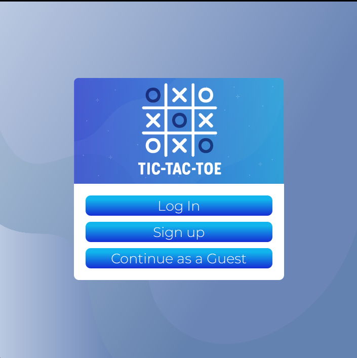
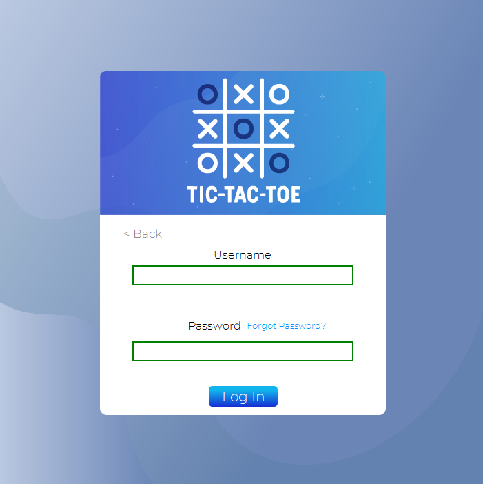
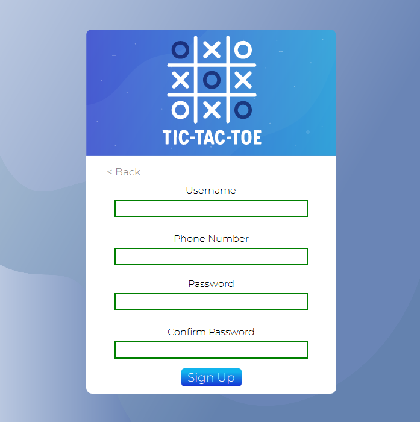
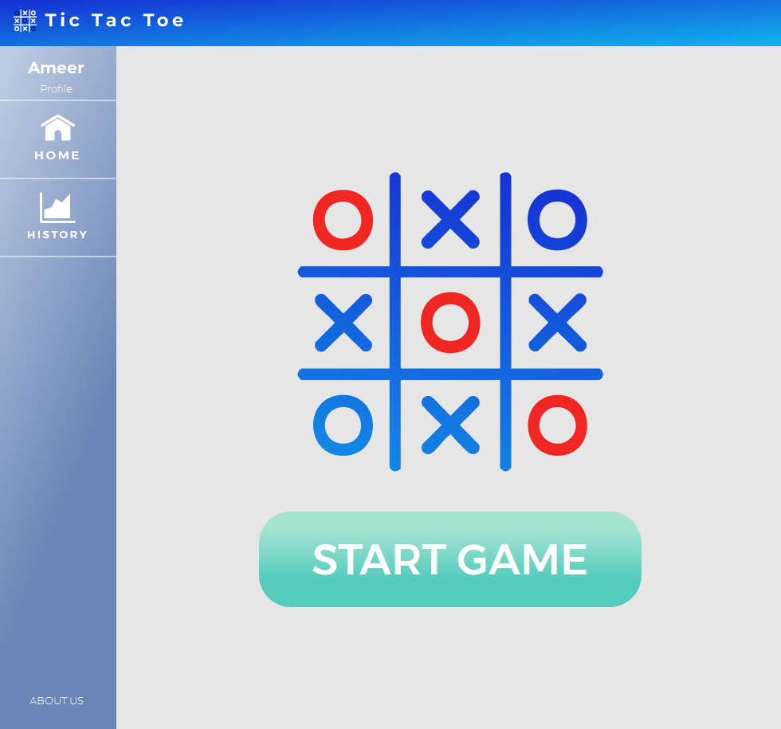
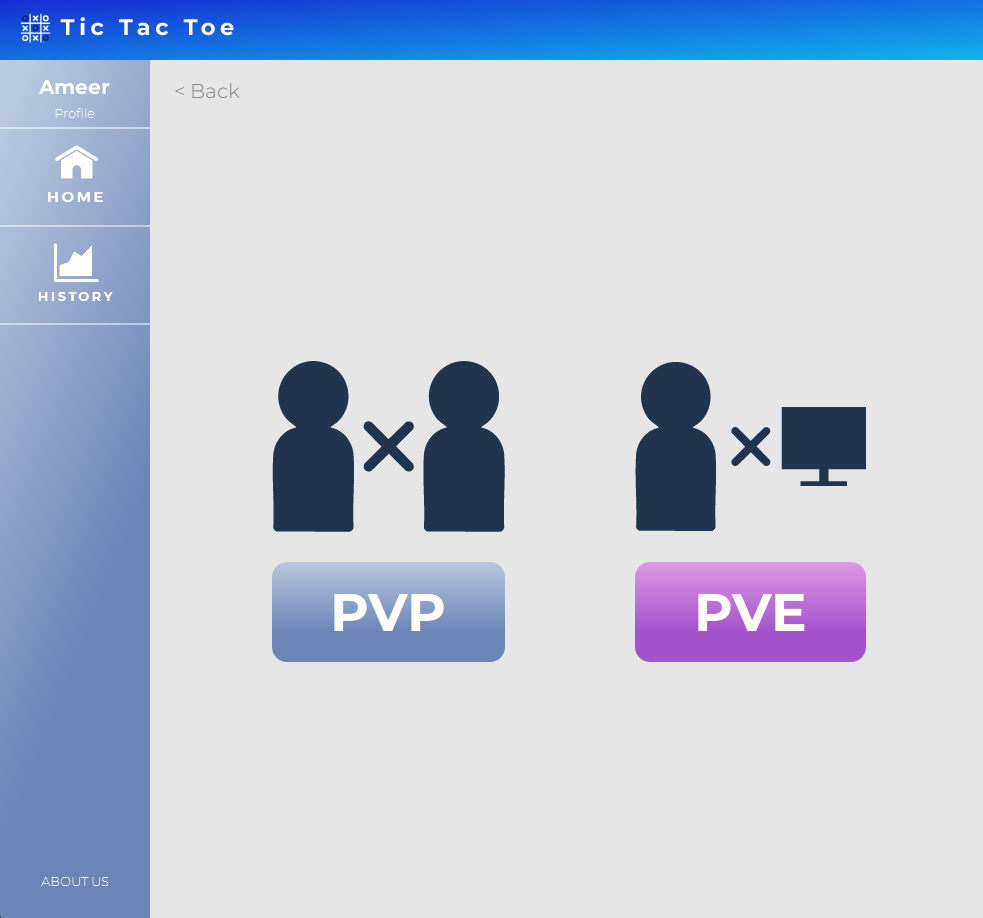
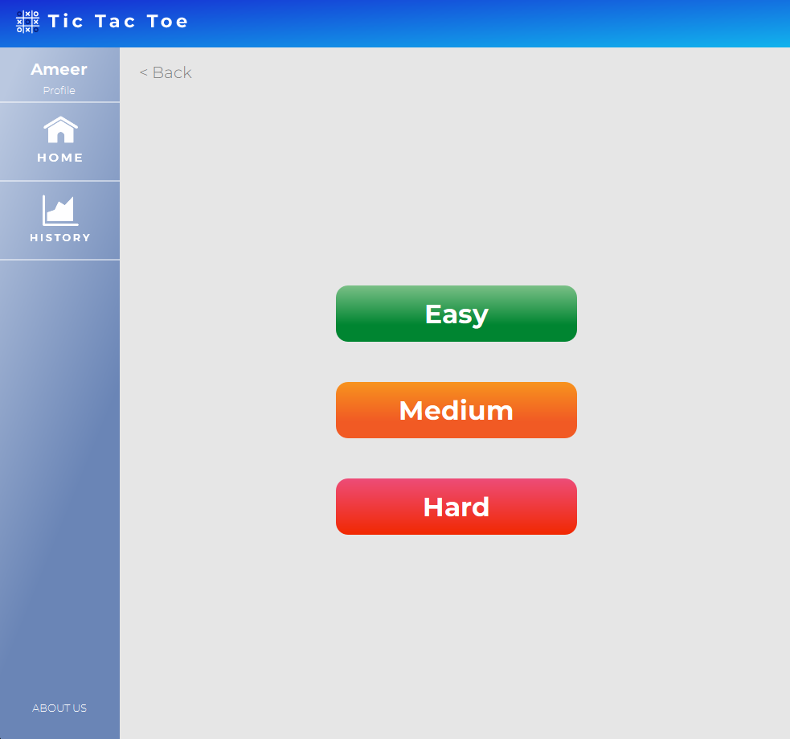
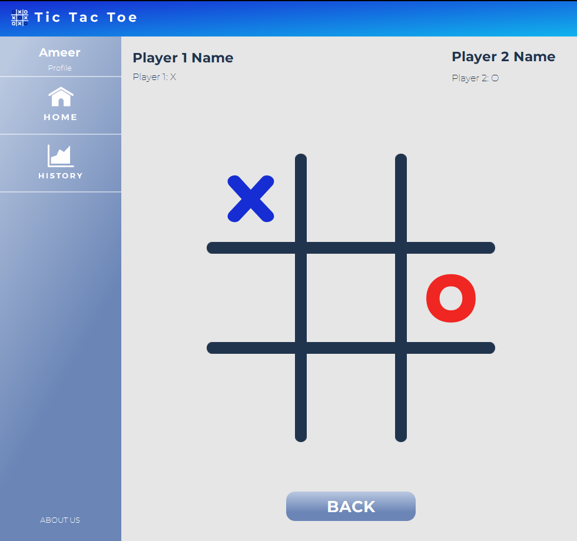
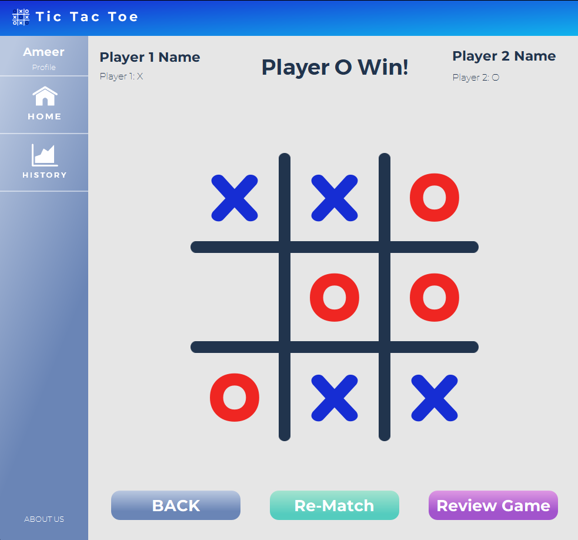
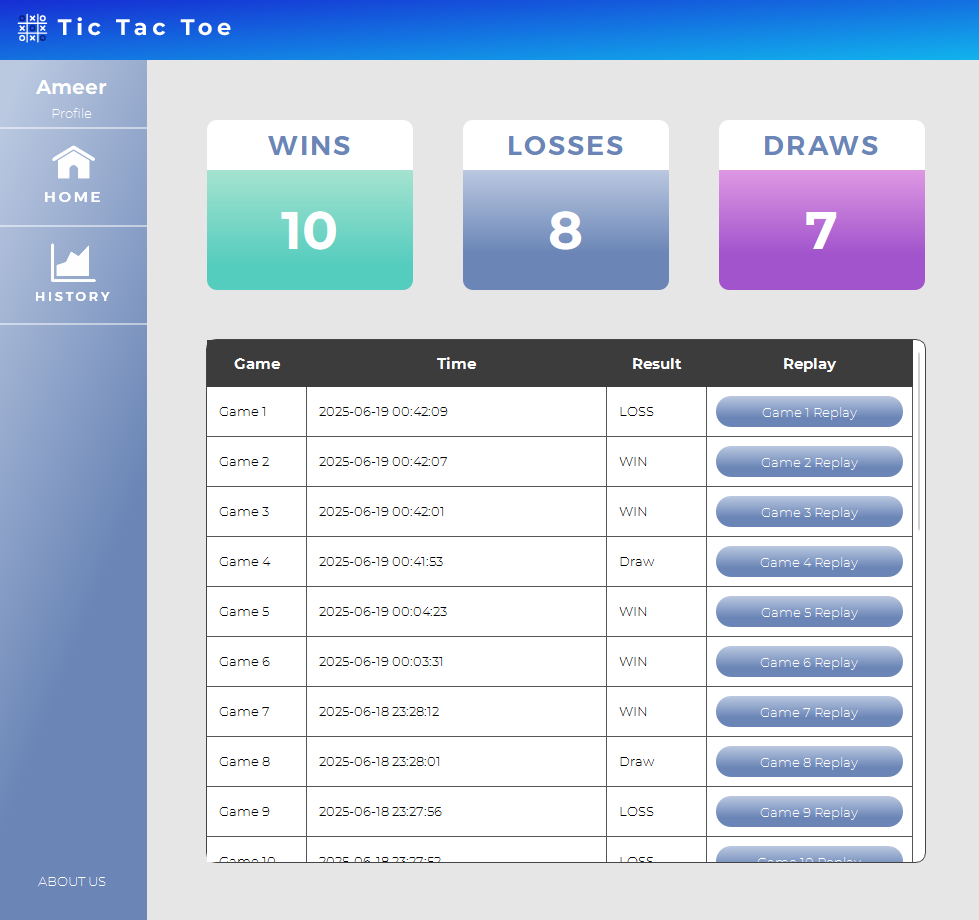

# Tic Tac Toe Embedded System 2027


by @ameerlouly @AmirSameh1 @capo35 @RolaRefaat @Nouramf


>[!NOTE]
>Contains everything related to the TicTacToe project for the Embedded Systems Course Taught by Dr Omar Nasr at the Faculty of Engineering Cairo Unviersity

### How to create installer:
Make sure you have Qt's binary creator installer on your machine and its BIN folder added to your PATH

Then excuted the following command:
```bash
binarycreator -c config/config.xml -p packages TicTacToeInstaller.exe
```

## Game Features:

- **PVP** and **PVE** Modes 🙍‍♂️🤖
- AI with multiple **Difficulties**
    - Easy 🟢
    - Medium 🟠
    - Hard 🔴
- Game Review 🔄️
- Game History Tracking 📈:
    - Record all previous games.
    - Replay each game.
    - Track the total number of game Won, Lost or Draws.
- Challenging **Infinite Mode**

## Technical Features
This project was a full-stack desktop application utilizing different Software-Developments techniques and components.

- Built using Qt Framework
- Uses Minimax algorithm with Alpha-Beta Pruning for PVE Mode
- Custom designed Sleek UI
- Database using SQLite
- Hashing using SHA-2 hashing family for data encryption on database
- Secure Session Management
- Custom made installer to work on any machine
- Github Repo for version tracking
- CI/CD pipeline ensures each commit is valid
- GUI and Logic testing using Qtest
- Clean code following the Betty-Style rules
- Installer using Qt Binary Creator or alternativley Inno Setup.

## Gallery









